# 📋 Tako — Gestionnaire de Tâches

<div align="center">


**Une application mobile moderne de gestion de tâches avec vue Kanban, statistiques et notifications.**

</div>

---

##  Description

**Tako** est une application mobile de gestion de tâches développée avec **Flutter** et **Dart**, suivant une architecture **MVC** (Modèle-Vue-Contrôleur). Elle offre une interface sombre et soignée permettant de gérer les tâches du quotidien, avec synchronisation via une API REST (MockAPI.io).

---

##  Fonctionnalités

| Fonctionnalité | Statut |
|---|---|
| Authentification (Login / Inscription) | ✅ |
| CRUD complet des tâches | ✅ |
| Catégories personnalisables | ✅ |
| Priorités (Haute / Moyenne / Basse) | ✅ |
| Vue Liste & Vue Kanban (drag & drop) | ✅ |
| Calendrier des échéances | ✅ |
| Statistiques et graphiques | ✅ |
| Notifications locales (rappels) | ✅ |
| Mode sombre / clair / auto | ✅ |
| Synchronisation API REST (MockAPI.io) | ✅ |

---

##  Captures d'écran

| Landing | Connexion | Inscription |
|---|---|---|
| 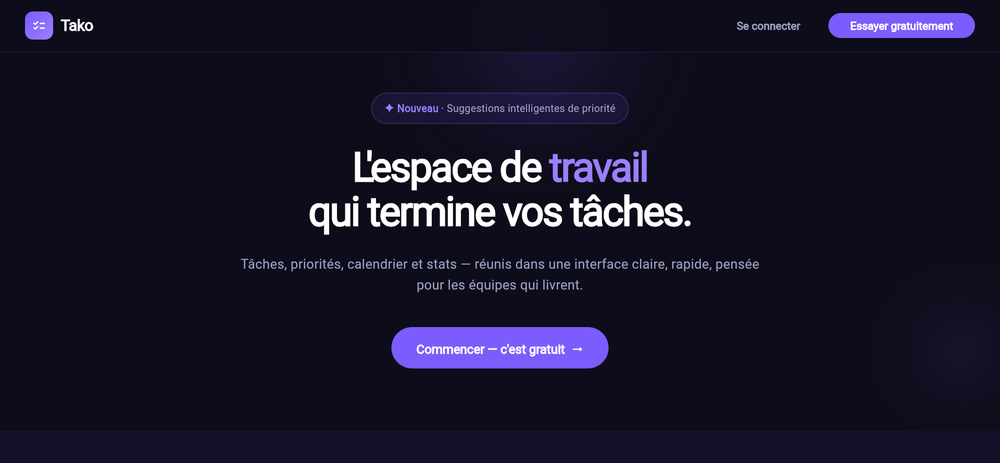 |  | 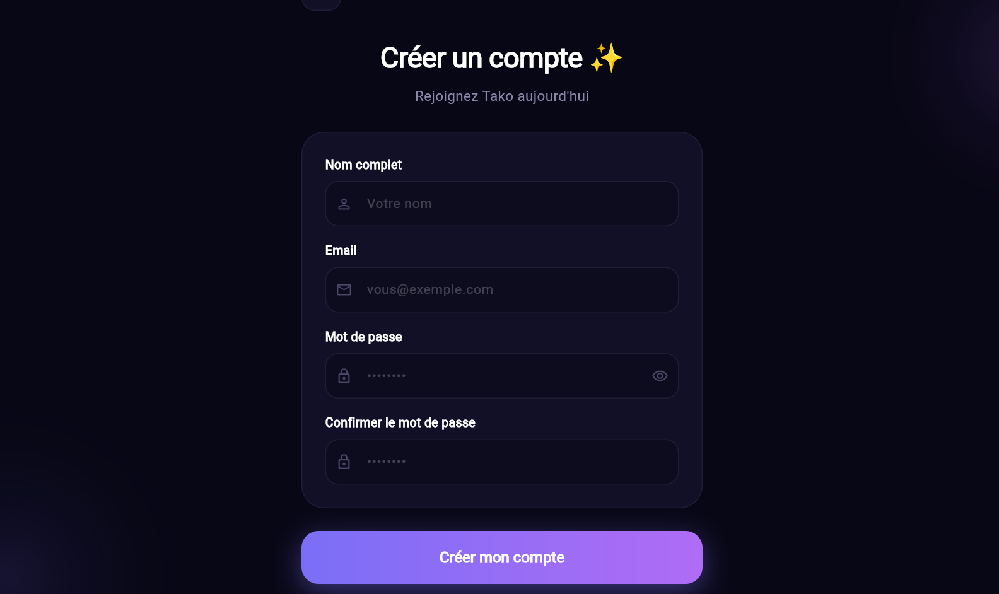 |

| Accueil (Liste) | Kanban | Statistiques (Graphiques) | Statistiques (Résumé) |
|---|---|---|---|
| 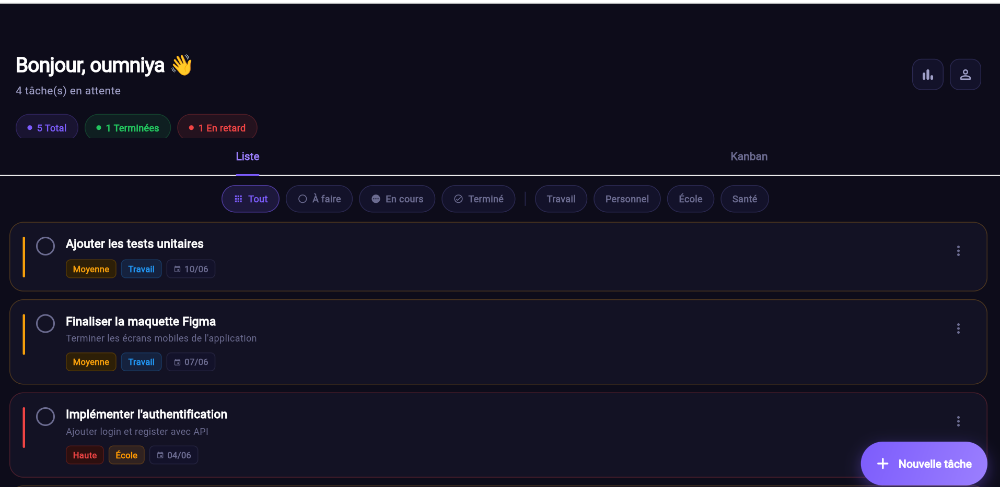 | 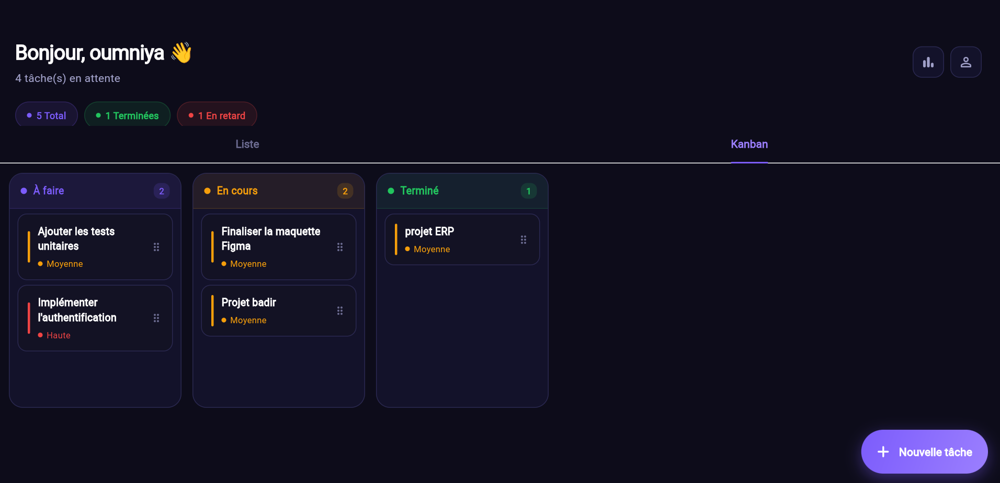 | 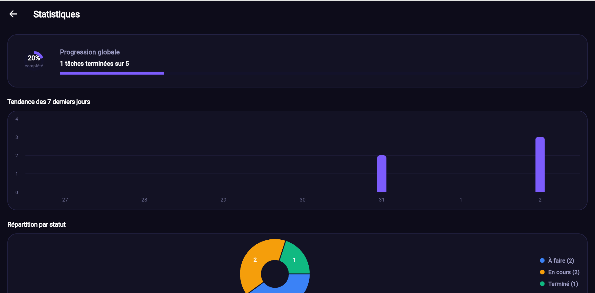 | 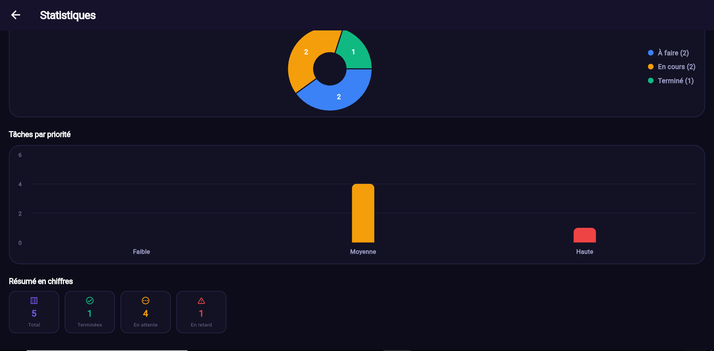 |

| Formulaire tâche | Détail tâche | Profil |
|---|---|---|
| 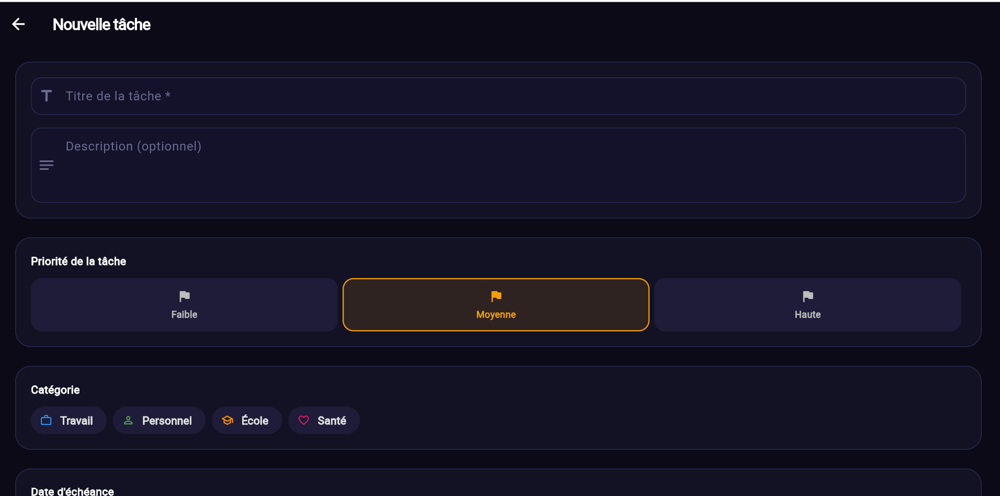 | 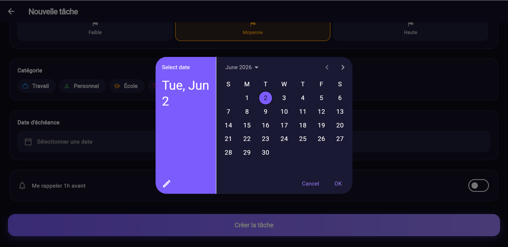 | 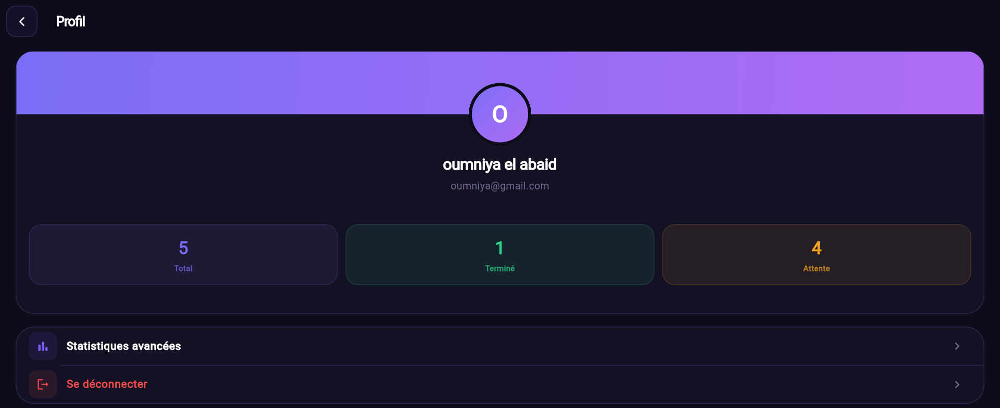 |

---

##  Architecture MVC

Tako adopte une architecture **MVC (Modèle - Vue - Contrôleur)** claire et modulaire :

```
lib/
├── main.dart                      # Point d'entrée de l'application
│
├── models/                        #  MODÈLES — Structures de données
│   ├── task.dart                  # Modèle Tâche (titre, priorité, statut, échéance...)
│   ├── user.dart                  # Modèle Utilisateur (nom, email, id...)
│   └── category.dart              # Modèle Catégorie (nom, couleur)
│
├── views/                         #  VUES — Interface utilisateur
│   ├── screens/                   # Pages complètes
│   │   ├── landing_screen.dart    # Écran de démarrage
│   │   ├── login_screen.dart      # Connexion
│   │   ├── register_screen.dart   # Inscription
│   │   ├── home_screen.dart       # Accueil (liste + kanban intégré)
│   │   ├── kanban_screen.dart     # Vue Kanban dédiée
│   │   ├── task_form_screen.dart  # Formulaire création/édition tâche
│   │   ├── task_detail_screen.dart# Détail d'une tâche
│   │   ├── stats_screen.dart      # Statistiques & graphiques
│   │   ├── profile_screen.dart    # Profil utilisateur
│   │   └── calendar_screen.dart   # Calendrier des échéances
│   └── widgets/                   # Composants réutilisables
│       ├── task_card.dart         # Carte tâche (liste)
│       └── filter_chips.dart      # Filtres de tâches
│
├── controllers/                   #  CONTRÔLEURS — Logique métier
│   ├── auth_controller.dart       # Gestion authentification
│   ├── task_controller.dart       # Gestion CRUD tâches & catégories
│   └── theme_controller.dart      # Gestion thème sombre/clair
│
├── services/                      #  SERVICES — Couche externe
│   ├── api_service.dart           # Appels HTTP (MockAPI.io)
│   └── notification_service.dart  # Notifications locales planifiées
│
├── routes/                        #  NAVIGATION
│   └── app_router.dart            # Configuration GoRouter
│
└── theme/                         #  THÈME
    └── app_theme.dart             # Couleurs, typographie, styles globaux
```

### Flux de données

```
Vue (Screen)
    │  action utilisateur
    ▼
Contrôleur (Provider)
    │  appelle le service
    ▼
Service (ApiService)
    │  HTTP request
    ▼
API REST (MockAPI.io)
    │  JSON response
    ▼
Modèle (Task / User / Category)
    │  notifyListeners()
    ▼
Vue (rebuild automatique)
```

---

##  Installation

### Prérequis

- [Flutter SDK](https://flutter.dev/docs/get-started/install) **3.22+**
- [Dart SDK](https://dart.dev/get-dart) **3.4+**
- Android Studio ou VS Code
- Un émulateur Android/iOS ou un appareil physique

### Étapes d'installation

**1. Cloner le dépôt**
```bash
git clone https://github.com/elabaidoumniya/tako-task-manager.git
cd tako-task-manager
```

**2. Installer les dépendances**
```bash
flutter pub get
```

**3. Vérifier la configuration Flutter**
```bash
flutter doctor
```

**4. Configurer l'API** *(optionnel — déjà configuré par défaut)*

Ouvrir `lib/services/api_service.dart` et modifier l'URL si besoin :
```dart
static const String _baseUrl = 'https://6a1e08cabcc4f20d5ca5488c.mockapi.io';
```

**5. Lancer l'application**
```bash
flutter run
```

---

##  Dépendances principales

| Package | Version | Rôle |
|---|---|---|
| `provider` | ^6.1.2 | Gestion d'état (pattern MVC) |
| `go_router` | ^14.2.0 | Navigation déclarative |
| `sqflite` | ^2.3.3 | Base de données locale SQLite |
| `http` | ^1.2.1 | Requêtes HTTP vers l'API |
| `flutter_local_notifications` | ^17.0.0 | Notifications locales planifiées |
| `fl_chart` | ^0.68.0 | Graphiques (statistiques) |
| `intl` | ^0.19.0 | Formatage des dates |
| `timezone` | ^0.9.0 | Gestion fuseaux horaires (notifications) |

---

##  API REST

L'application utilise **MockAPI.io** comme backend simulé.

```
Base URL : https://6a1e08cabcc4f20d5ca5488c.mockapi.io
```

| Méthode | Endpoint | Description |
|---|---|---|
| `GET` | `/tasks?userId={id}` | Récupérer les tâches d'un utilisateur |
| `POST` | `/tasks` | Créer une nouvelle tâche |
| `PUT` | `/tasks/{id}` | Modifier une tâche |
| `DELETE` | `/tasks/{id}` | Supprimer une tâche |
| `GET` | `/users?email={email}` | Chercher un utilisateur par email |
| `POST` | `/users` | Créer un compte utilisateur |
| `GET` | `/categories?userId={id}` | Récupérer les catégories |
| `POST` | `/categories` | Créer une catégorie |

---

##  Notifications

Le service de notifications (`NotificationService`) planifie automatiquement un rappel **1 heure avant** l'échéance de chaque tâche. Les notifications sont gérées localement via `flutter_local_notifications` et `timezone`.

---

##  Auteurs

Développé dans le cadre d'un projet académique — **Juin 2026**

| Membre | Rôle |
|---|---|
| El abaid Oumniya | Développement Flutter / Architecture MVC |

---
##  Problème rencontré avec MockAPI.io

Lors du déploiement de l'API sur MockAPI.io, nous avons rencontré une limitation du **plan gratuit**.

### Limitation identifiée

| Élément | Statut |
|---|---|
| Nombre de ressources créées | 2 / 2 maximum |
| Ressources disponibles | `tasks` (50 données) et `users` (55 données) |
| Ressource manquante | `categories` (non créée par manque de quota) |

### Impact sur l'application

- ✅ **Fonctionnalités principales** (authentification, CRUD tâches) : **fonctionnent parfaitement**
- ⚠️ **Catégories** : gérées en **local** uniquement (non synchronisées via l'API)

### Solution adoptée

L'application continue de fonctionner normalement avec :
- API distante pour `tasks` et `users`
- Gestion locale des `categories` (stockage interne à l'application)

### Captures de l'interface MockAPI.io

| Ressources créées | Données users |
|---|---|
| 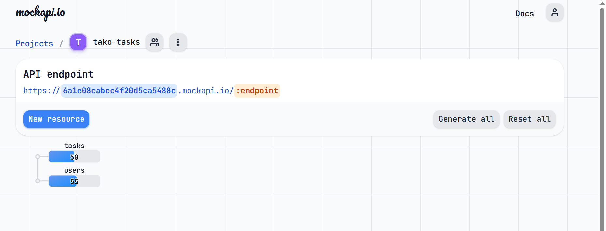 | 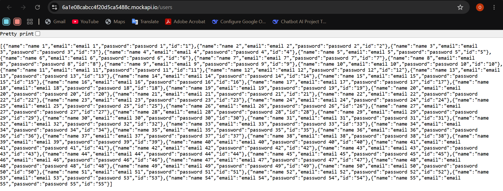 |

### Conclusion

Malgré cette limitation, l'application reste **entièrement fonctionnelle** et démontre l'intégration réussie d'une API REST déployée sur le cloud.

